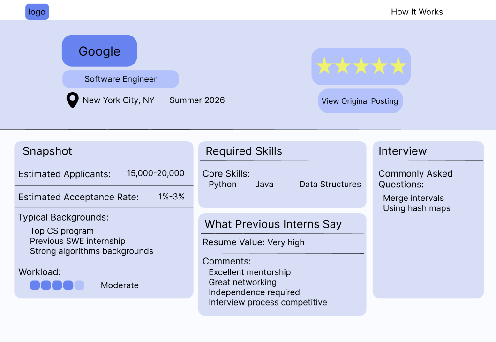

# HireSense

HireSense is a full-stack web application designed to help students make more informed decisions during the internship search by surfacing insights that are often difficult to find in traditional job postings.

The platform analyzes internship opportunities to provide information on factors such as estimated competitiveness, required skills, typical applicant backgrounds, interview preparation, and previous intern experiences. HireSense was developed as part of Tech@NYU's Tech Treks program using web scraping, data processing, and full-stack development.

## Product Preview

*Early product wireframe illustrating HireSense's internship analysis dashboard.*

## Features

- Analyzes internship postings to provide additional context beyond the original job description
- Surfaces estimated competitiveness and applicant insights
- Identifies relevant skills and common candidate backgrounds
- Provides interview preparation information and commonly asked questions
- Incorporates previous intern experiences and insights
- Uses web scraping and data processing to collect and organize internship information

## Development

HireSense was developed collaboratively as part of Tech@NYU's Tech Treks program. My contributions focused primarily on full-stack development and application integration, including:

- Building frontend components for company information and "How It Works" pages
- Developing Flask API endpoints to serve internship and company data
- Connecting Flask backend endpoints to the Supabase database
- Integrating frontend pages with backend APIs to retrieve company and role information
- Adding backend endpoints for reputation data and interview questions
- Collaborating through Git/GitHub using feature branches, merges, and conflict resolution
  
## Tech Stack

- **Frontend:** React
- **Backend:** Python, Flask
- **Database:** Supabase
- **Data Collection:** Web scraping
- **Collaboration & Version Control:** Git, GitHub

## About the Project

HireSense was created by a team of students through Tech@NYU's Tech Treks, a project-based program focused on building technical experience through collaborative software development.

The project gave our team experience taking an idea from initial planning through development while learning new technologies, collaborating through Git and GitHub, and iterating on features throughout the development process.
